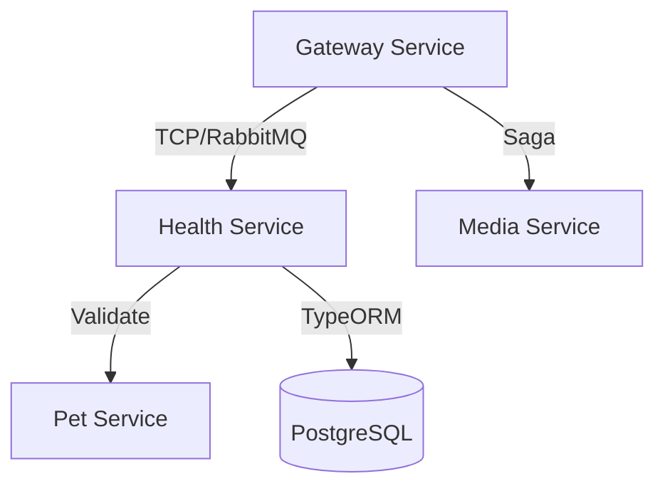
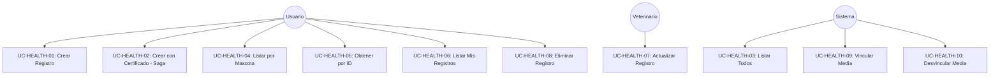
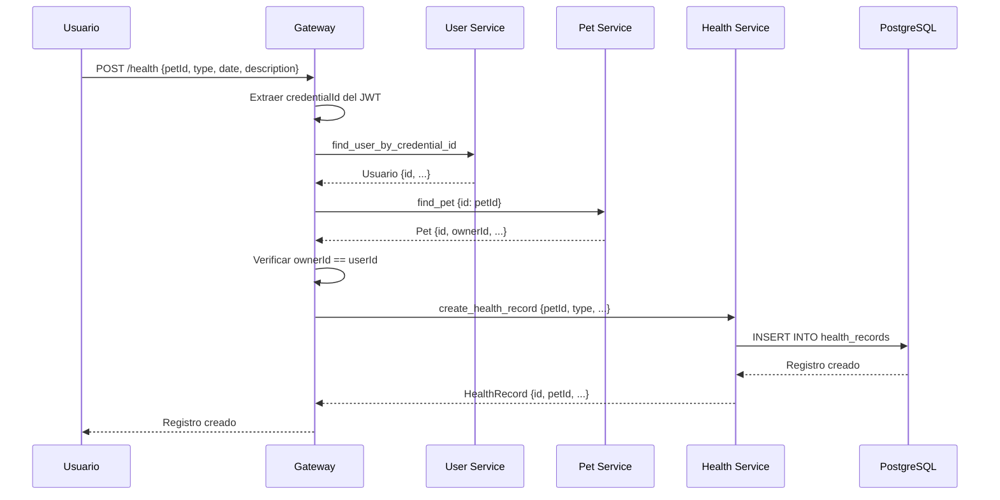
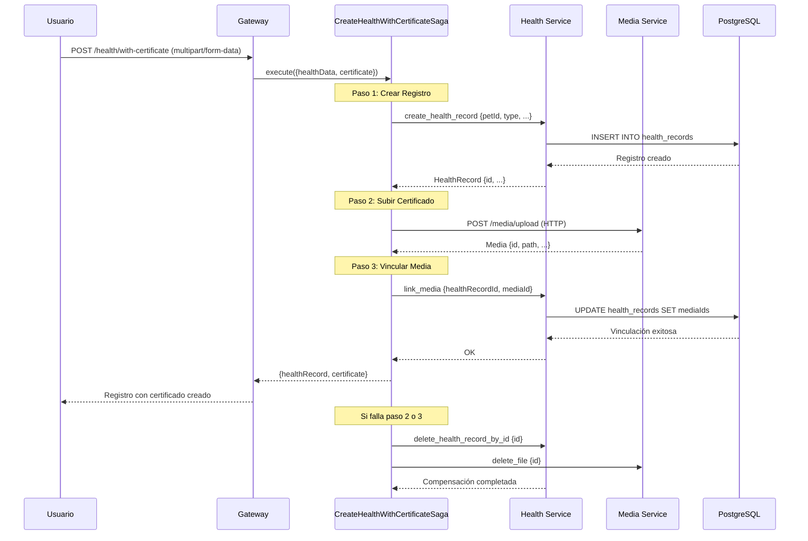
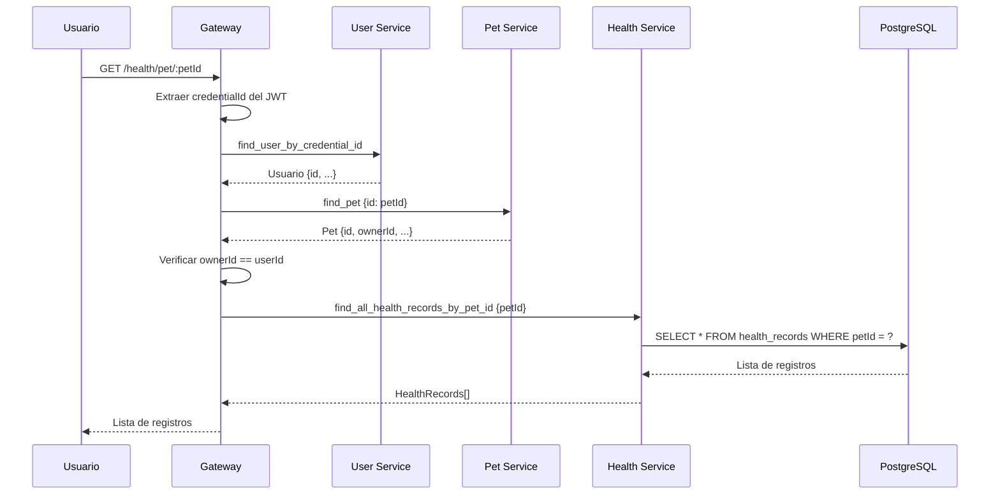
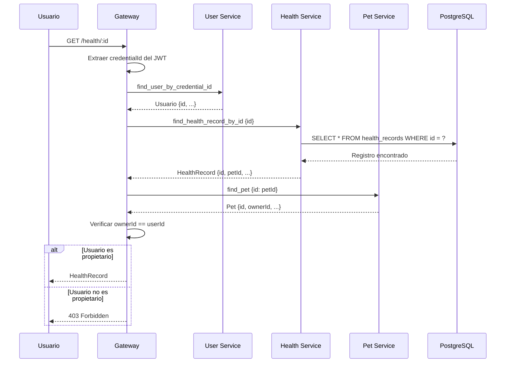
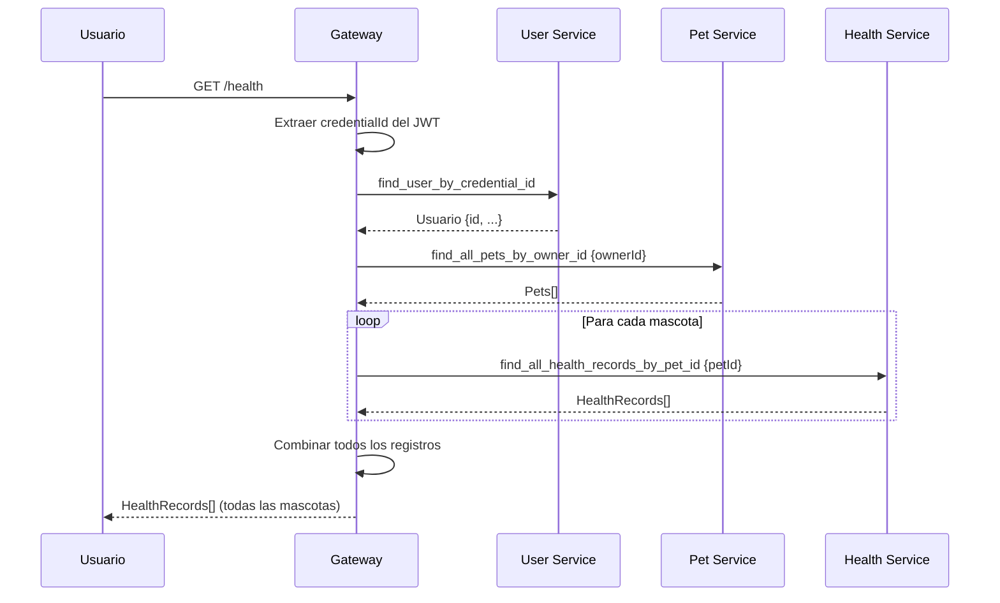
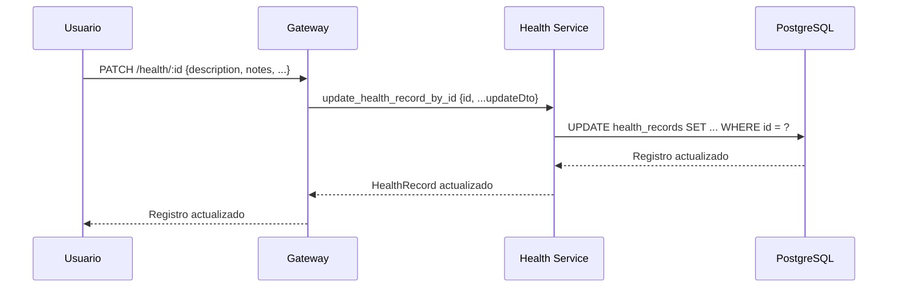
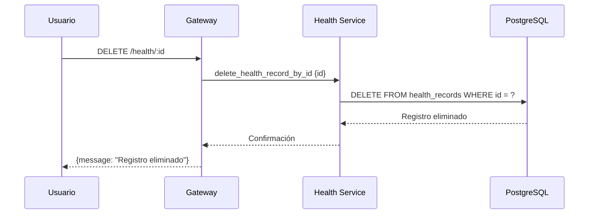

# Health Service

## Descripción

Servicio de gestión de registros de salud para mascotas en la aplicación "Libreta Sanitaria de Mascotas". Maneja vacunas, consultas veterinarias, tratamientos, y certificados médicos.

## Tecnologías

- **Framework**: NestJS
- **Base de Datos**: PostgreSQL (con TypeORM)
- **Mensajería**: RabbitMQ
- **Validación**: class-validator

## Arquitectura



## Casos de Uso

### Diagrama General de Casos de Uso



---

### UC-HEALTH-01: Crear Registro de Salud

**Descripción**: Permite crear un nuevo registro de salud para una mascota.

**Actor**: Usuario

**Precondiciones**: 
- Usuario debe estar autenticado
- Mascota debe existir
- Usuario debe ser propietario de la mascota

**Flujo Principal**:
1. Usuario envía datos del registro (petId, type, date, description, etc.)
2. Gateway obtiene usuario por credentialId
3. Gateway valida que la mascota exista y pertenezca al usuario
4. Gateway envía datos al Health Service
5. Health Service crea registro en base de datos
6. Health Service retorna registro creado

**Postcondiciones**:
- Registro de salud creado

**Diagrama de Secuencia**:



---

### UC-HEALTH-02: Crear Registro de Salud con Certificado (Saga)

**Descripción**: Crea un registro de salud con certificado médico adjunto usando patrón Saga.

**Actor**: Usuario/Veterinario

**Precondiciones**: 
- Usuario debe estar autenticado
- Mascota debe existir y pertenecer al usuario
- Certificado debe ser válido (PDF, JPEG, PNG)
- Tamaño máximo: 10MB

**Flujo Principal**:
1. Usuario envía datos del registro + certificado
2. Gateway inicia Saga "CreateHealthWithCertificateSaga"
3. **Paso 1**: Crear registro de salud en Health Service
4. **Paso 2**: Subir certificado al Media Service con entityType='health'
5. **Paso 3**: Vincular media al registro de salud
6. Saga retorna registro y certificado creados
7. Gateway retorna resultado al usuario

**Flujo de Compensación** (si falla):
- Si falla paso 3: Eliminar certificado y registro
- Si falla paso 2: Eliminar registro creado
- Si falla paso 1: No hay compensación necesaria

**Postcondiciones**:
- Registro de salud creado
- Certificado subido y vinculado

**Diagrama de Secuencia**:



---

### UC-HEALTH-03: Listar Todos los Registros de Salud

**Descripción**: Obtiene lista de todos los registros (uso administrativo).

**Actor**: Sistema/Administrador

**Precondiciones**: 
- Ninguna

**Flujo Principal**:
1. Sistema solicita lista de todos los registros
2. Health Service consulta base de datos
3. Health Service retorna lista completa

**Postcondiciones**:
- Lista de registros retornada

---

### UC-HEALTH-04: Listar Registros de Salud por Mascota

**Descripción**: Obtiene todos los registros de salud de una mascota específica.

**Actor**: Usuario

**Precondiciones**: 
- Usuario debe estar autenticado
- Mascota debe existir
- Usuario debe ser propietario de la mascota

**Flujo Principal**:
1. Usuario solicita registros de una mascota
2. Gateway obtiene usuario por credentialId
3. Gateway valida que la mascota pertenezca al usuario
4. Gateway solicita registros al Health Service
5. Health Service consulta base de datos
6. Health Service retorna lista de registros

**Postcondiciones**:
- Lista de registros de la mascota retornada

**Diagrama de Secuencia**:



---

### UC-HEALTH-05: Obtener Registro de Salud por ID

**Descripción**: Obtiene información detallada de un registro de salud específico.

**Actor**: Usuario

**Precondiciones**: 
- Usuario debe estar autenticado
- Registro debe existir
- Usuario debe ser propietario de la mascota asociada

**Flujo Principal**:
1. Usuario solicita registro por ID
2. Gateway obtiene usuario por credentialId
3. Gateway solicita registro al Health Service
4. Health Service retorna registro
5. Gateway obtiene mascota asociada
6. Gateway verifica que el usuario sea propietario
7. Gateway retorna registro al usuario

**Postcondiciones**:
- Datos del registro retornados

**Diagrama de Secuencia**:



---

### UC-HEALTH-06: Listar Todos los Registros del Usuario Autenticado

**Descripción**: Obtiene todos los registros de salud de todas las mascotas del usuario.

**Actor**: Usuario

**Precondiciones**: 
- Usuario debe estar autenticado

**Flujo Principal**:
1. Usuario solicita todos sus registros de salud
2. Gateway obtiene usuario por credentialId
3. Gateway obtiene todas las mascotas del usuario
4. Gateway solicita registros de cada mascota al Health Service
5. Gateway combina todos los registros
6. Gateway retorna lista completa

**Postcondiciones**:
- Lista de todos los registros del usuario retornada

**Diagrama de Secuencia**:



---

### UC-HEALTH-07: Actualizar Registro de Salud

**Descripción**: Actualiza información de un registro de salud existente.

**Actor**: Usuario/Veterinario

**Precondiciones**: 
- Usuario debe estar autenticado
- Registro debe existir

**Flujo Principal**:
1. Usuario envía datos actualizados
2. Gateway solicita actualización al Health Service
3. Health Service actualiza registro en base de datos
4. Health Service retorna registro actualizado

**Postcondiciones**:
- Registro actualizado

**Diagrama de Secuencia**:



---

### UC-HEALTH-08: Eliminar Registro de Salud

**Descripción**: Elimina un registro de salud del sistema.

**Actor**: Usuario

**Precondiciones**: 
- Usuario debe estar autenticado
- Registro debe existir

**Flujo Principal**:
1. Usuario solicita eliminar registro
2. Gateway solicita eliminación al Health Service
3. Health Service elimina registro de base de datos
4. Health Service retorna confirmación

**Postcondiciones**:
- Registro eliminado

**Diagrama de Secuencia**:



---

### UC-HEALTH-09: Vincular Media a Registro de Salud

**Descripción**: Asocia un archivo multimedia (certificado, radiografía, etc.) a un registro de salud.

**Actor**: Sistema (Saga)

**Precondiciones**: 
- Registro de salud debe existir
- Media debe existir en Media Service

**Flujo Principal**:
1. Sistema solicita vincular media
2. Health Service agrega mediaId al array de mediaIds del registro
3. Health Service actualiza registro en base de datos
4. Health Service retorna confirmación

**Postcondiciones**:
- Media vinculado al registro

---

### UC-HEALTH-10: Desvincular Media de Registro de Salud

**Descripción**: Elimina la asociación de un archivo multimedia con un registro de salud.

**Actor**: Sistema (Saga - Compensación)

**Precondiciones**: 
- Registro de salud debe existir
- Media debe estar vinculado

**Flujo Principal**:
1. Sistema solicita desvincular media
2. Health Service elimina mediaId del array de mediaIds
3. Health Service actualiza registro en base de datos
4. Health Service retorna confirmación

**Postcondiciones**:
- Media desvinculado del registro

---

## Entidades Principales

### HealthRecord Entity

```typescript
{
  id: string (UUID)
  petId: string (FK a Pet Service)
  type: string (ej: "vaccine", "checkup", "treatment", "surgery")
  date: Date
  description: string
  veterinarian?: string
  clinic?: string
  notes?: string
  nextDate?: Date (para vacunas o controles)
  mediaIds?: string[] (FKs a Media Service)
  createdAt: Date
  updatedAt: Date
}
```

## Message Patterns (RabbitMQ)

| Comando | Descripción |
|---------|-------------|
| `create_health_record` | Crear nuevo registro |
| `find_all_health_records` | Listar todos los registros |
| `find_health_record_by_id` | Obtener registro por ID |
| `find_all_health_records_by_pet_id` | Obtener registros por mascota |
| `update_health_record_by_id` | Actualizar registro |
| `delete_health_record_by_id` | Eliminar registro |
| `link_media` | Vincular media a registro |
| `unlink_media` | Desvincular media de registro |

## API Endpoints (Gateway)

| Método | Endpoint | Descripción | Autenticación |
|--------|----------|-------------|---------------|
| POST | `/health` | Crear registro de salud | ✅ JWT |
| POST | `/health/with-certificate` | Crear con certificado (Saga) | ✅ JWT |
| GET | `/health` | Listar mis registros | ✅ JWT |
| GET | `/health/pet/:petId` | Listar por mascota | ✅ JWT |
| GET | `/health/:id` | Obtener registro por ID | ✅ JWT |
| PATCH | `/health/:id` | Actualizar registro | ✅ JWT |
| DELETE | `/health/:id` | Eliminar registro | ✅ JWT |

## Sagas

### CreateHealthWithCertificateSaga

**Propósito**: Garantizar consistencia al crear registro con certificado

**Pasos**:
1. Crear registro de salud en Health Service
2. Subir certificado al Media Service
3. Vincular media al registro de salud

**Compensaciones**:
- Si falla paso 3: Eliminar certificado y registro
- Si falla paso 2: Eliminar registro creado

**Resiliencia**:
- Timeout: 3000ms por paso
- Reintentos: 2 intentos con delay incremental (300ms, 600ms)

## Variables de Entorno

```env
# Database
DATABASE_HOST=localhost
DATABASE_PORT=5432
DATABASE_USER=postgres
DATABASE_PASSWORD=postgres
DATABASE_NAME=health_db

# RabbitMQ
RABBITMQ_URL=amqp://localhost:5672
```

## Instalación y Ejecución

```bash
# Instalar dependencias
npm install

# Ejecutar migraciones
npm run migration:run

# Modo desarrollo
npm run start:dev

# Modo producción
npm run build
npm run start:prod
```

## Puerto

- **3004** (TCP para RabbitMQ)
